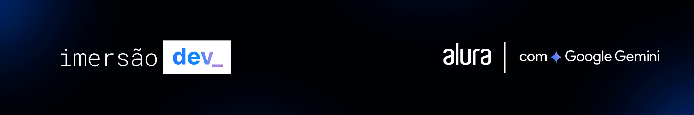

# Imersão Dev | Alura com Google Gemini

## HTML, CSS, JavaScript e Gemini

### Aprenda HTML, CSS e JavaScript e desenvolva um projeto do zero com a ajuda do Gemini, a IA do Google. Cinco aulas gratuitas, com especialistas da área e certificado de participação.

- Aula 01: Iniciando o Projeto com HTML e CSS
- Aula 02: Estilizando o projeto com CSS

#### Ana Maria | [ww.anamaria.dev.br/](https://www.anamaria.dev.br/)